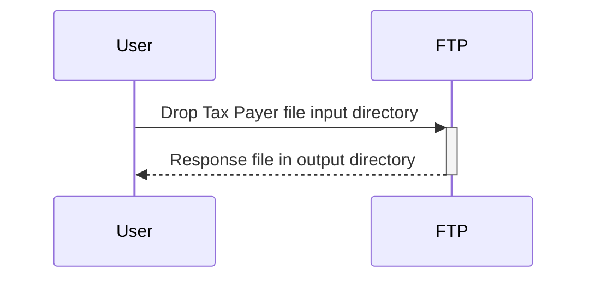

# Mulesoft ETL demo

  
  
  
<br>
Mulesoft ETL for extracting and process tax payers data
  
## Table of contents
1. [Description](#description)
1. [Prerequisites](#prerequisites) 
1. [Build and packaging](#build-and-packaging)
1. [Running in Anypoint Studio](#running-in-anypoint-studio)
1. [Exchange deployment](#exchange-deployment)

## Description  
Mulesoft ETL for extracting and process tax payers data. The next diagram shows the architecture of the service:


<br>
 
## Prerequisites
To compile and build the project:

 - Java Development Kit (JDK) 8. Must be version 8!
 - Apache Maven, version 3.8.X
 - A settings.xml with proper configuration to access:
   - The Anypoint organization maven repository
   - The Mulesoft EE repositories (to run the test cases)
 - Optional: Anypoint Studio.

Deployment in Anypoint Exchange:

 - A connected app for maven deployment

<br>

## Build and packaging

Configure the maven settings file with:
 - The credentials for the Maven Nexus EE repository
 - Connected app for deployment in the Anypoint organization.

The sensitive data was removed from the configuration files. The next properties must be provided to compile, test and package the service:

| Property    | Description |
| ----------- | ----------- |
| ftp.username | Username to access the ftp server |
| ftp.password | Password to access the ftp server |

Mac example: 

```bash
#Properties for salesforce
export ftp_username=myuser
export ftp_password=user@fakegmail.com

mvn clean package \
-Dftp.username=$ftp_username \
-Dftp.password=$ftp_password
```

<br>

## Running in Anypoint Studio

In Anypoint Studio, go to: Create, Manage and run configurations. Go to configure the VM Arguments for the mule application to run in Anypoint Studio. Provide next arguments with the correct credentials:
```bash
-M-XX:-UseBiasedLocking 
-M-Dfile.encoding=UTF-8 
-M-XX:+UseG1GC 
-M-XX:+UseStringDeduplication
-M-Dftp.username=myusername
-M-Dftp.password=user@fakegmail.com
-M-Dftp.host=myhost
```

## Exchange deployment
maven command to deploy asset in anypoint exchange:


```bash 
mvn deploy
```

<br>

---
- [Markdown cheatsheet](https://github.com/adam-p/markdown-here/wiki/Markdown-Cheatsheet)
- [Mulesoft documentation](https://docs.mulesoft.com/general/)
- [Git log standard](https://github.com/ahmadawais/Emoji-Log)
- [Github badges](https://badgen.net/github)