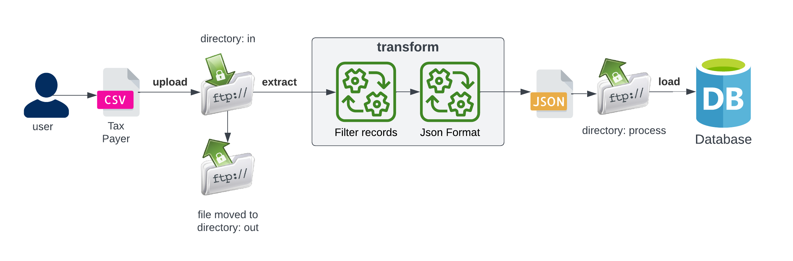
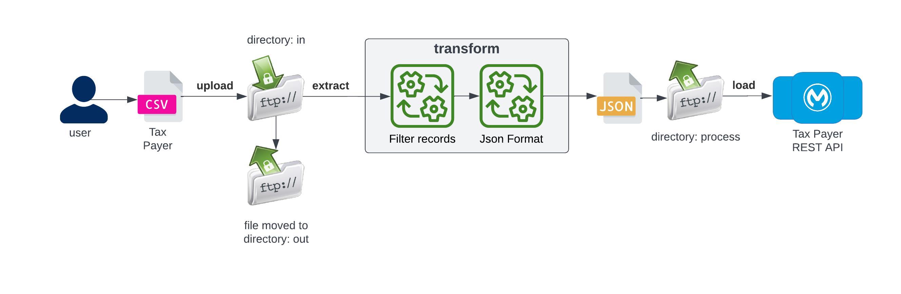
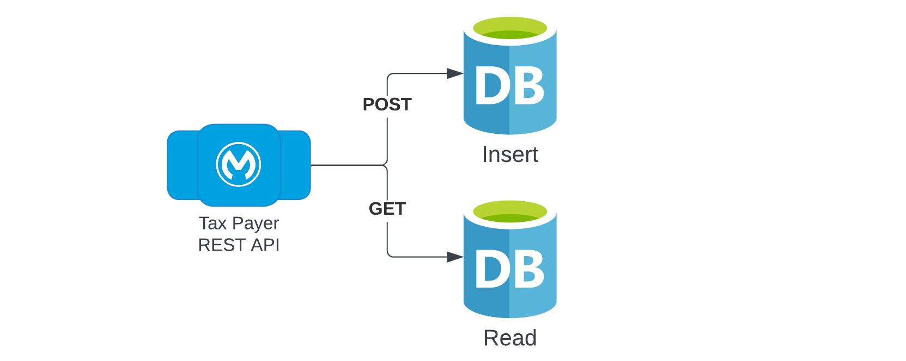

# Mulesoft ETL demo

  
<br>
Mulesoft ETL for extracting and process tax payers data with an embedded ANSI/ISO SQL Database 
  
## Table of contents
1. [Description](#description)
1. [Prerequisites](#prerequisites) 
1. [Build and packaging](#build-and-packaging)
1. [Running in Anypoint Studio](#running-in-anypoint-studio)
1. [Exchange deployment](#exchange-deployment)

## Description  
Mulesoft ETL for extracting and process tax payers data. The application implements next flows:
1. ETL for extracting, convert and push tax payer records to a database. The next diagram shows main functionality:



Input csv file, example:

```bash
FIRSTNAME,LASTNAME,TYPE-TIN,TIN
Joe,Canales,SSN,123
Luke,Skywalker,ITIN,234
```

Output Json file:
```json
[
  {
    "firstName": "Joe",
    "lastName": "Canales",
    "typeTin": "SSN",
    "tin": "123"
  },
  {
    "firstName": "Luke",
    "lastName": "Skywalker",
    "typeTin": "ITIN",
    "tin": "234"
  }
]
```

Database schema:

```sql
CREATE TABLE demodb.TAX_PAYER (
	ID INTEGER NOT NULL GENERATED ALWAYS AS IDENTITY (START WITH 1, INCREMENT BY 1),
	FIRST_NAME VARCHAR(100),
	LAST_NAME VARCHAR(100),
	TYPE_TIN VARCHAR(100),
	TIN VARCHAR(100),
	PRIMARY KEY (ID)
);
```

2. Instead of implementing the complete functionallity in the ETL, a better aproach is to create a reusable service that can be called by other components and hide the completixity to load and get data from the database, example:




The API implements 2 operations: GET and POST 


URL: http://localhost:8081/api/taxpayer

<br>
 
## Prerequisites
To compile and build the project:

 - Java Development Kit (JDK) 8. Must be version 8!
 - Apache Maven, version 3.8.X
 - A settings.xml with proper configuration to access:
   - The Anypoint organization maven repository
   - The Mulesoft EE repositories (to run the test cases)
 - Optional: Anypoint Studio.

Deployment in Anypoint Exchange:

 - A connected app for maven deployment

<br>

## Build and packaging

Configure the maven settings file with:
 - The credentials for the Maven Nexus EE repository
 - Connected app for deployment in the Anypoint organization.

The sensitive data was removed from the configuration files. The next properties must be provided to compile, test and package the service:

| Property    | Description |
| ----------- | ----------- |
| ftp.username | Username to access the ftp server |
| ftp.password | Password to access the ftp server |
| ftp.host | Ftp server hostname |

Mac example: 

```bash
#Properties for salesforce
export ftp_username=myuser
export ftp_password=user@fakegmail.com
export ftp_host=myhostname

mvn clean package \
-Dftp.username=$ftp_username \
-Dftp.password=$ftp_password \
-Dftp.host=$ftp_host
```

<br>

## Running in Anypoint Studio

In Anypoint Studio, go to: Create, Manage and run configurations. Go to configure the VM Arguments for the mule application to run in Anypoint Studio. Provide next arguments with the correct credentials:
```bash
-M-XX:-UseBiasedLocking 
-M-Dfile.encoding=UTF-8 
-M-XX:+UseG1GC 
-M-XX:+UseStringDeduplication
-M-Dftp.username=myusername
-M-Dftp.password=user@fakegmail.com
-M-Dftp.host=myhost
```

## Exchange deployment
maven command to deploy asset in anypoint exchange:


```bash 
mvn deploy
```

<br>

---
- [Markdown cheatsheet](https://github.com/adam-p/markdown-here/wiki/Markdown-Cheatsheet)
- [Mulesoft documentation](https://docs.mulesoft.com/general/)
- [Git log standard](https://github.com/ahmadawais/Emoji-Log)
- [Github badges](https://badgen.net/github)